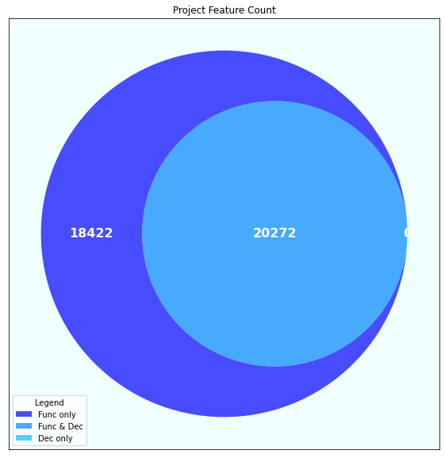
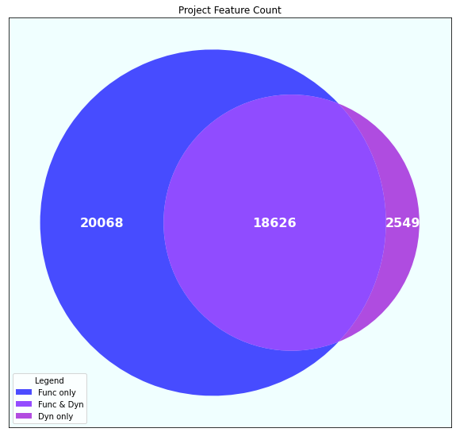
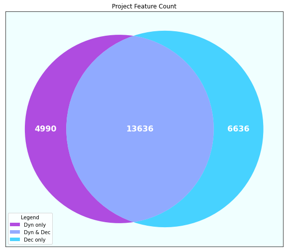
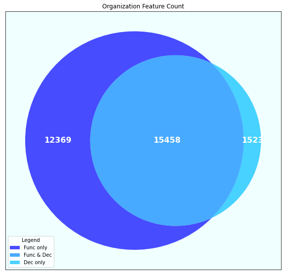
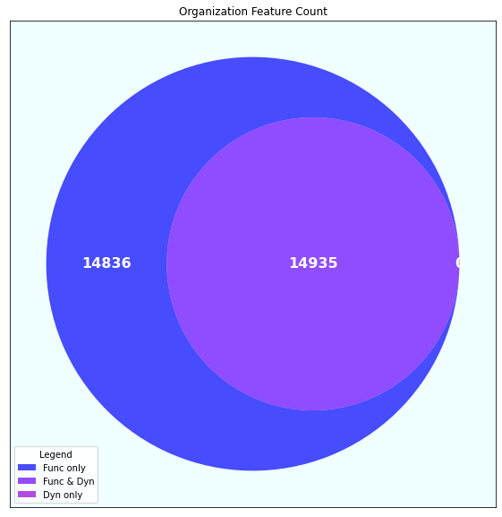
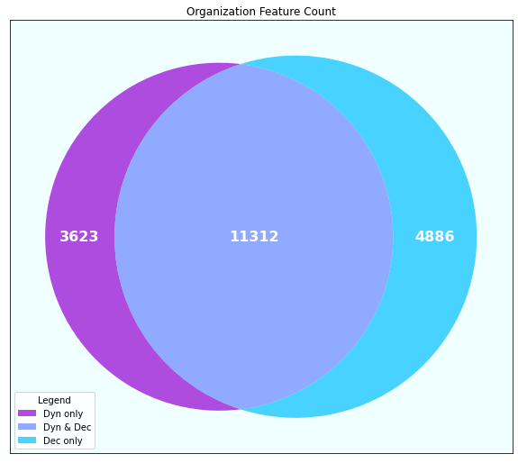

# AST Analysis of Python

This project mines a large Python repository and extract statistics using various methods.

## Table of Contents
  * [Introduction](#introduction)
  * [Methods](#methods)
    * [Data](#data)
    * [Mining](#mining)
    * [Analysis](#analysis)
      * [Overall](#overall)
      * [Relationship Between Features](#relationship-between-features)
      * [Dynamic Feature](#dynamic-feature)
  * [Results](#results)
    * [Overall](#overall)
    * [Relationship Between Features](#relationship-between-features)
    * [Machine Learning](#machine-learning)
    * [Dynamic Feature](#dynamic-feature)
  * [Requirements](#requirements)
  * [Download Results](#download-results)

## Introduction

The begining of this project aimed to analyze a randomly sorted large repository of Python programs to see the uses of dynamic features (`eval()`,`getattr()` and so on). Later the project extended to also include functional features (`lambda()`,`yield()` and so on) and decorators (`@property`,`@classmethod` and so on). Uses of some features like `eval` directly disables Python run-time to optimize a program. At the same time, there are many languages, such as `c/c++` and even `Javascript`, that can do the same while still having the capability for more optimization.  Using the AST library in Python3, enables us to mine millions of programs written in Python. 
The analysis is on Dynamic features, functional features, and decorators of Python programs.


## Methods

We aquired around 1.3 million python files from Github. 

### Data

A bash script that goes through the Github repository downloads the files satisfying `has .py extension`, `is not sorted`, and `is public`.
(to be continued...)

### Mining Program


In the root folder of this project input command
```
./run.sh
```
Then input the folder name to start the mining.
The result will be written a file named "ast_analysis_data.csv" in the root folder.

### Load into SQL

The provided sql script "ast_analysis.sql" will load the result into a database called "astmine" in table "output".
Some query script are provided in the file "sql_scripts.sql".

### Analysis

We use SQL, Python, and Excel to analyze and present the data. Few questions we aim to answer include: What percentage of Python programs have used Dynamic features? Are the dynamic features need for the given tasks, or can they be replaced by static methods? For a given organization, is the use of decorators/dynamic/functional features increase the probability of using one of the features again?
Four AI models are choosen to generate and study the data. 

#### Overall

The initial theory is that most/larger proportions of programers would not use dynamic/functional/decorators in their programs. In those programs that do use one of them, there is a greater probability that they would use one other features out of the three.
The result will be presented with diagrams and tables.

#### Relationship Between The Features

In our initial analysis, it seems to be a corelation between the features. AI models may disqualify or verify our theory by the giving the prediction probability number. If the given probability on a prediction supports our theory, then we can conclude that there is a strong corelation between the features presented.
We define this number as:
"Given an organization have used one of f, d, or c; there is x probability that the organization would use another feature out of the three." 

#### Dynamic Features

Another goal of our study is to see whether most programers' uses of Python Dynamic features are justified. Our theory is most uses of dynamic features in Python can be replaced with static ones in reasonable amount of rewrite. 
We randomly choose 40 programs in the repository and read the source code to determine if they are nessesarry or not. If a large proportion of the source code shows that they are not nessesarry, it proves our theory is correct. Otherwise, our theory is not correct.  

## Results

### Overall 


Total 1,385,873 files.

feature | count | %
-- | -- | --
none | 2,756,890 | 71.7%
functional | 427,169 | 11.1%
decorators | 157,443 | 4.0%
dynamic | 140,344 | 3.7%
functional & dynamic | 133,717 | 3.5%
functional & decorators | 101,406 | 2.6%
functional & dynamic & decorators | 91,660 | 2.4%
dynamic & decorators | 35,836 | 0.9%

 
Total 48614 Organizations.
 
Total 43079 Projects.


### Relationship Between the Features

<table><tr>
<td> Functional & Decorators </td>
<td> Functional & Dynamic </td>
<td> Dynamic & Decorators </td>
</tr><tr>
<td>   </td>
<td> </td>
<td>   </td>
</tr><tr>
<td>   </td>
<td> </td>
<td>   </td>
</tr></table>

The results showing organization/project grouped diagrams for the three features. Functional features (dark blue) is greater than dynamic and decorators feature uses; always having bigger overlap with the other two features. 


Dynamic feature and decorators each have about half mutually exclusive proportions.

### Machine Learning 
Our initial estimation using [Excel](https://github.com/2042Third/ast_analysis_python/blob/main/ast_ml/python_repo_stat.xlsx) gives a probability of \*66%. 


ML model | prediction probability
-- | --
Bayesian Linear Regression | ~63%
\*\* Gaussian Naive Bayesian | ~93% or ~6%
Logistic Regression | ~55%
Neural Network | ~63%

- `Bayesian Regresson` is fitting for this research since there are enough data to "stanbilize" the model, where models like this has a frequentist approach. Also contrasting to the other models, this gives a single number that tells whether or not the prior belief is supported. 

- A continuous data should benefit from a classifier model that supports it. However `Gaussian Naive Bayes` would give polarized results if the sets have very high spread. Given new  data for a prediction, this model is very accurate (94.4%), but due to the fundamentals of Gaussian statistics it cannot prove or disprove our theory. 

- Despite being a binary classifier (`Logistic Regression`), we wanted to see if the multiclass model under the hood can test out the three feature given one feature (functional). It does support our thoery, but is fairly inaccurate (79%). 

- The `Neural Network` prediction is given 3 layers of 11 neurons. We expect the model to zero-in on the proportions of functional features. It does support our theory; each non-zero input gives around 63% prediction probability.

\*Given an organization have used one of f, d, or c; there is x probability that the organization would use another feature out of the three.

\*\* Gaussian Naive Bayesian would not be able to give a prediction probability because the formula estimates using maximum likelihood.


### Dynamic Feature

There are 40 source files read. 3 out of 40 source files used dynamic feature in a context that cannot be replaced by static features.

To be finished

## Requirements

- python3
- Unix Environment
- numpy(ml, diagram)
- matplot(diagram)
- panda(ml)
- scikit-learn(ml)
- squarify(treemap)
- c++ boost(json reader)

## Download Results

<a href="https://pdm.pw/mine/downloads/" target="_blank" rel="noopener noreferrer">list of all data used</a><br>
<a href="https://u.pcloud.link/publink/show?code=kZzeQXVZoMoIpOYVxByj71P5dHYoY4viIMNV" target="_blank" rel="noopener noreferrer">bigquery data (25 gb)</a>


